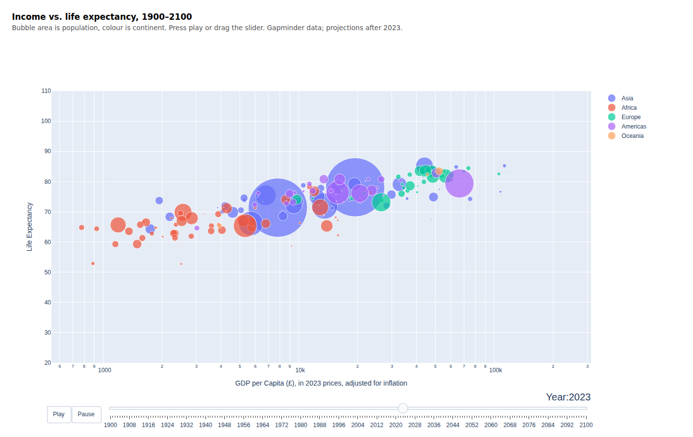
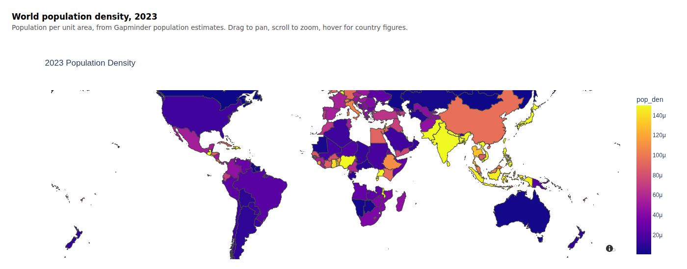

# viz-demo

Interactive Python visualisations of global population, income and life expectancy,
built as a live demo for a company webinar. All data used here is publicly available.

The notebook — [`viz-group-python-demo.ipynb`](viz-group-python-demo.ipynb) — covers four things:

1. **What a dataset is missing** — `missingno` for a quick audit of gaps in a dataset.
2. **Preparing the world data** — reshaping three Gapminder series into one long frame.
3. **Population density on a map** — a GeoPandas + Plotly choropleth.
4. **Income vs. life expectancy** — an animated bubble chart, 1900–2100.

## The interactive figures

GitHub strips JavaScript out of notebook output, so both Plotly figures are saved as
standalone pages under [`figures/`](figures). Download one and open it in a browser to
get the hover, zoom and animation back:

| | |
|---|---|
| [`gapminder_bubble_chart.html`](figures/gapminder_bubble_chart.html) | income vs. life expectancy, one frame per year |
| [`population_density_map.html`](figures/population_density_map.html) | 2023 population density, pan and zoom |

## Data

Population, GDP per capita and life expectancy come from
[Gapminder](https://www.gapminder.org/data/) (CC BY 4.0); the continent lookup is
`countryContinent.csv`. Two sections need files that aren't kept here — a movies dataset
and a world-boundaries shapefile — and the notebook says so where they're used.

## Running it

Needs `pandas`, `geopandas`, `plotly` and `missingno`. Checked against pandas 3.0 and
plotly 7.1; the saved figures need plotly.js 2.x, which they pull from a CDN.
